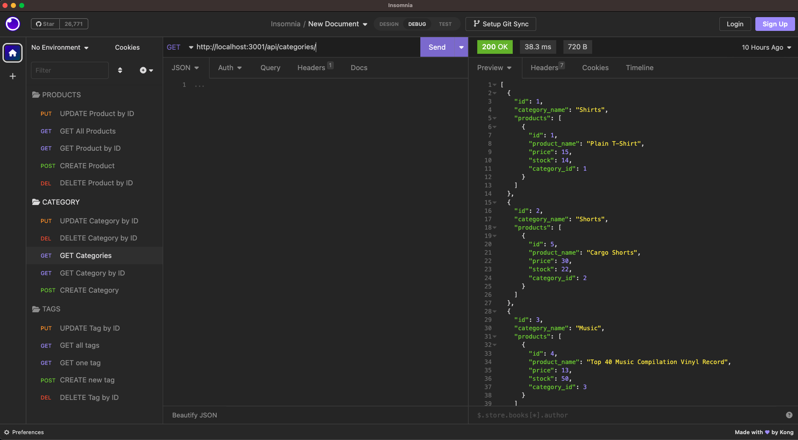

# E-commerce Back End

## User Story
AS a manager at an internet retail company I want a back end for e-commerce website that uses the latest technologies. So that my company can compete with other e-commerce companies

## Description
* Note: You will need Insomnia Core to check the results of the api routes
* This is a functional Express.js API. User will login using their own sql username and password to the env file. Then login to mysql and run the schema file. To seed the database, you will run "npm run seed".

* Start the server by running "npm run watch".

* When the user opens the API GET routes in Insomnia Core for categories, products, or tags, the data for each of these routes is displayed in a formatted JSON. When the user uses the API POST, PUT, and DELETE routes in Insomnia Core the user will successfully create, update, and delete data in the database.

## Table of Contents
- [Installation](#installation)
- [Usage](#usage)
- [How to Contribute](#how-to-contribute)
- [Questions](#questions)
- [License](#license)

## Installation
* In the root directory you want to run "npm i" to install all the required packages.

## Usage
* User can type "npm start" to start the node server. Or use "npm run watch" to use nodemon. To seed the data in the table you will want to run "npm run seed"

* This project uses dotenv, mysql2, express and sequelize packages.

## License
* This project is under the MIT license.
* If you want to get more details about the license, please visit [Choose License](https://choosealicense.com "Choose License")

## How to Contribute
* Feel free to contact via email or github or fork my repo and request for pull request!

## Tests
* Some inputs will have vaildation and throw errors if data type aren't meeting the requirements.

## Questions
* Please contact me via my [Github Username](https://github.com/johnxlai)

* You can reach me with additional questions <a href="mailto:lai.john.py@gmail.com">lai.john.py@gmail.com</a>

# Screenshot

## Repo
https://github.com/johnxlai/ecommerce-back-end
## WalkThrough Video
https://drive.google.com/file/d/12D88DOl_d6vjTMbGkkMtJogqd5Qu3mlk/view
